# FT-991/A Audiomanager — Bedienungsanleitung

**Version:** siehe *Hilfe → Version* in der Anwendung  
**Autor:** Jörg Körner, DK8DE  
**Download & Updates:** [GitHub Releases](https://github.com/DK8DE/FT991AudioManager/releases)  
**Englische Version:** [UserManual_EN.md](UserManual_EN.md)  
**Screenshots:** Ordner [`docs/screenshots/de/`](docs/screenshots/de/) — siehe [README dort](docs/screenshots/README.md)

---

## Inhaltsverzeichnis

1. [Installation](#1-installation)
2. [Einrichtung am Funkgerät (CAT)](#2-einrichtung-am-funkgerät-cat)
3. [Soundeinstellungen — Grundeinrichtung](#3-soundeinstellungen--grundeinrichtung)
4. [Verbindung herstellen und trennen](#4-verbindung-herstellen-und-trennen)
5. [Hauptfenster](#5-hauptfenster)
6. [Menü *Datei*](#6-menü-datei)
7. [Menü *Funktionen*](#7-menü-funktionen)
8. [Menü *Ansicht*](#8-menü-ansicht)
9. [Menü *Hilfe*](#9-menü-hilfe)
10. [Einstellungsdialog im Detail](#10-einstellungsdialog-im-detail)
11. [Tastenkürzel](#11-tastenkürzel)
12. [Fehlerbehebung](#12-fehlerbehebung)
13. [Anhang: Wichtige FT-991-Menüs](#13-anhang-wichtige-ft-991-menüs)

---

## 1. Installation

### 1.1 Download von GitHub

1. Öffne die Release-Seite:  
   **https://github.com/DK8DE/FT991AudioManager/releases**
2. Lade die aktuelle Version herunter:
   - **Windows-Installer** (empfohlen), oder
   - **ZIP/Portable-Version** aus dem Release-Asset
3. Führe die Installation aus bzw. entpacke das Archiv in einen Ordner deiner Wahl.

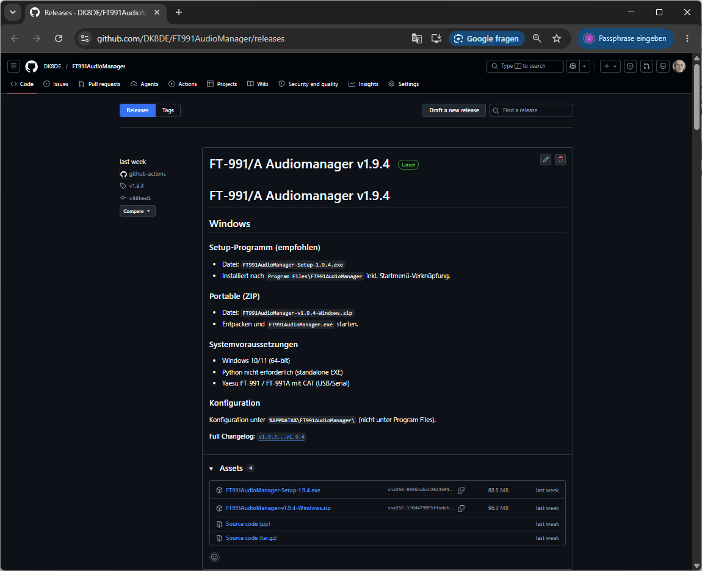

*Abb. 1: GitHub Releases-Seite — aktuelles Release und Download-Asset auswählen. (Screenshot-Platzhalter)*

### 1.2 Hinweis zu Windows-Sicherheit (SmartScreen & Antivirus)

Da das Programm von einem privaten Entwickler stammt und nicht über den Microsoft Store verteilt wird, kann Windows das Programm als **unbekannt** einstufen:

| Meldung | Was tun? |
|---------|----------|
| **Windows SmartScreen** („Windows hat den PC geschützt … Unbekannter Herausgeber“) | Auf **Weitere Informationen** klicken → **Trotzdem ausführen** wählen |
| **Antivirus / Defender** beim Download | Datei als **vertrauenswürdig** bestätigen oder Ausnahme hinzufügen |
| **Blockade bei der Installation** | Installer mit Rechtsklick → **Als Administrator ausführen** (falls nötig) und erneut bestätigen |

Das ist bei selbst gebauten Amateurfunks-Programmen normal und bedeutet nicht automatisch, dass die Software schädlich ist. Lade das Programm **nur** von der offiziellen GitHub-Seite oben herunter.

### 1.3 Erster Start

Nach der Installation starte **FT-991/A Audiomanager** über das Startmenü oder die Desktop-Verknüpfung. Beim ersten Start sind noch keine CAT-Einstellungen gespeichert — das ist erwartet.

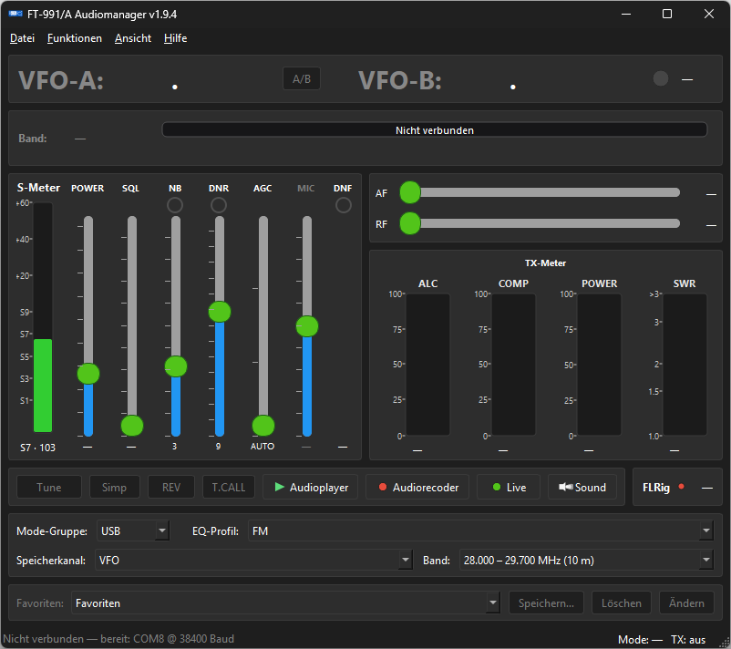

*Abb. 2: Hauptfenster ohne CAT-Verbindung. (Screenshot-Platzhalter)*

---

## 2. Einrichtung am Funkgerät (CAT)

### 2.1 USB-Verbindung

1. Verbinde den **FT-991** oder **FT-991A** per **USB** mit dem PC (eingebauter USB-Anschluss oder **SCU-17**).
2. Schalte das Funkgerät **ein**.
3. Windows installiert ggf. automatisch den USB-Treiber; warte, bis der COM-Port im Geräte-Manager sichtbar ist.

### 2.2 COM-Port in der Software wählen

1. Öffne in der App: **Datei → Einstellungen…** (`Strg+E`)
2. Wähle im Bereich **CAT-Verbindung** den richtigen **COM-Port** aus.
3. Klicke bei Bedarf auf **Aktualisieren**, um die Portliste zu erneuern.

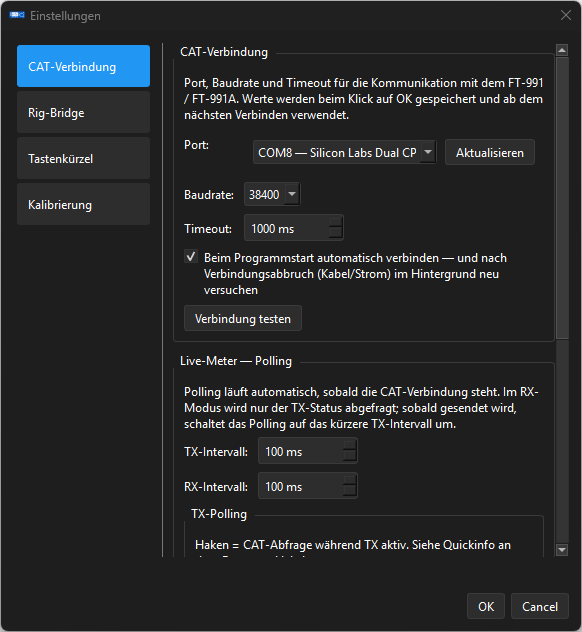

*Abb. 3: Einstellungen → CAT-Verbindung — Port, Baudrate, Verbindung testen. (Screenshot-Platzhalter)*

> **Wichtig — zwei gleich aussehende COM-Ports**  
> Am FT-991(A) erscheinen unter Windows typischerweise **zwei** COM-Ports:
>
> | Port | Bedeutung |
> |------|-----------|
> | **Enhanced COM Port** | ✅ **CAT-Schnittstelle** — diesen Port verwenden! |
> | **Standard COM Port** | ❌ CAT TIMING / TX-Trigger — **nicht** für diese Software |
>
> Wenn du unsicher bist: Port wählen → **Verbindung testen** (siehe unten). Reagiert das Funkgerät nicht, den **anderen** Port probieren.

### 2.3 Baudrate am Funkgerät einstellen

Die **Werks-Baudrate** für CAT ist **38400**.

**Am FT-991 / FT-991A:**

1. **[MENU]** drücken
2. Menüpunkt **031** aufrufen — Beschriftung: **`CAT RATE`**
3. Wert auf **38400** setzen (alternativ 4800 / 9600 / 19200 — dann **dieselbe** Rate in der App wählen)
4. Einstellung bestätigen / Menü verlassen

In der App (**Datei → Einstellungen… → CAT-Verbindung**) muss die **Baudrate identisch** sein (Standard: **38400**).

*Abb. 4: Funkgerät — Menü 031 „CAT RATE“ auf 38400. (Screenshot-Platzhalter)*

### 2.4 Verbindung testen

In den Einstellungen unter **CAT-Verbindung**:

1. Port und Baudrate setzen
2. **Verbindung testen** klicken
3. Bei Erfolg erscheint eine Bestätigung mit der Geräte-ID (FT-991 / FT-991A)

### 2.5 Erfolgskontrolle

Wenn alles richtig eingestellt ist, sollte nach **Datei → Verbinden** (`Strg+V`):

- die **Frequenz** (VFO-A und ggf. VFO-B) in der Software angezeigt werden,
- die **Betriebsart** (LSB, USB, FM, …) stimmen,
- **S-Meter**, SQL, AGC und weitere Werte live aktualisiert werden,
- in der **Statusleiste** unten „Verbunden“ mit Port und Baudrate erscheinen.

*Abb. 5: Hauptfenster mit aktiver CAT-Verbindung — Frequenz, Mode, Meter, Statusleiste. (Screenshot-Platzhalter)*

---

## 3. Soundeinstellungen — Grundeinrichtung

Die Audio-Zuordnung ist entscheidend für **Audio-Player**, **Audio-Recorder** und **Live‑PC Funk**.

Öffne: **Funktionen → Soundeinstellung…** (`Strg+Shift+S`)  
oder klicke im Hauptfenster in der Funksteuerungsleiste auf **Sound**.

### 3.1 Geräte & Lautstärke (Player / Recorder)

Typische Zuordnung bei Nutzung des **USB Audio CODEC** des Funkgeräts:

| Nr. | Einstellung | Gerät (Beispiel) |
|-----|-------------|------------------|
| 1 | **Aufnahme-Gerät** | `Microfon (USB Audio CODEC)` |
| 2 | **Sende-Ausgabe** | `Lautsprecher (USB Audio CODEC)` |
| 3 | **PC-Ausgabe** | Deine **PC-Soundkarte / Lautsprecher** (zum Vorhören am PC) |

Stelle für jedes Gerät die gewünschte **Lautstärke** ein.

Optional: **Ausgabe Mithören** — während einer CAT-Sendung (Player/Recorder) wird der Ton zusätzlich auf die PC-Ausgabe geschaltet.

### 3.2 Zuordnung für Live‑PC Funk

| Nr. | Einstellung | Gerät (Beispiel) |
|-----|-------------|------------------|
| 1 | **PC-Mikrofon für Live** | Dein **PC-Mikrofon**, mit dem du sprechen willst |
| 2 | **Monitor** | Deine **PC-Lautsprecher oder Kopfhörer** (Mithören) |
| 3 | **Funk-Eingabe** | `Lautsprecher (USB Audio CODEC)` (Empfang vom Funk → PC) |
| 4 | **Funk-Ausgabe / Sende-Ausgabe Live** | `Microfon (USB Audio CODEC)` (deine Stimme → Funk) |

> **Hinweis:** Die exakten Gerätenamen können je nach Windows-Treiber leicht abweichen (z. B. „Yaesu USB Audio“). Wähle jeweils das Gerät, das zum **USB Audio CODEC** des Funkgeräts gehört.

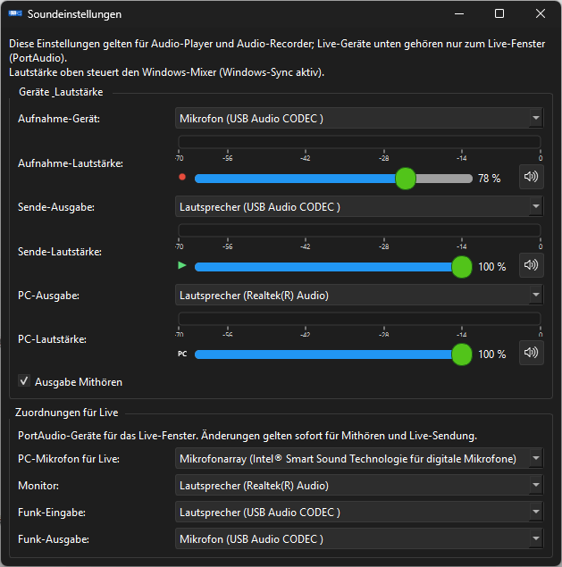

*Abb. 6: Soundeinstellungen — Geräte & Lautstärke sowie Zuordnung für Live‑PC Funk (ein Fenster). (Screenshot-Platzhalter)*

### 3.3 Grundeinstellung abgeschlossen

Mit korrekter CAT-Verbindung und Sound-Zuordnung ist die **Grundkonfiguration** fertig. Die folgenden Kapitel beschreiben alle Fenster und Funktionen im Detail.

---

## 4. Verbindung herstellen und trennen

| Aktion | Menü / Tastenkürzel |
|--------|---------------------|
| Verbinden | **Datei → Verbinden** — `Strg+V` |
| Trennen | **Datei → Trennen** — `Strg+T` |
| Einstellungen | **Datei → Einstellungen…** — `Strg+E` |

**Auto-Connect:** In den Einstellungen kann *Beim Programmstart automatisch verbinden* aktiviert werden. Bei Verbindungsabbruch versucht die App im Hintergrund alle 2 Sekunden, still wieder zu verbinden — bis du manuell **Trennen** wählst.

**Nach dem Verbinden** schreibt die App das gewählte **EQ-Profil** ins Funkgerät, lädt Speicherkanäle (oder nutzt einen Cache) und startet das **Meter-Polling**.

---

## 5. Hauptfenster

Das Hauptfenster ist die zentrale Steuerzentrale — VFO, Pegel, Profile und Schnellzugriffe.

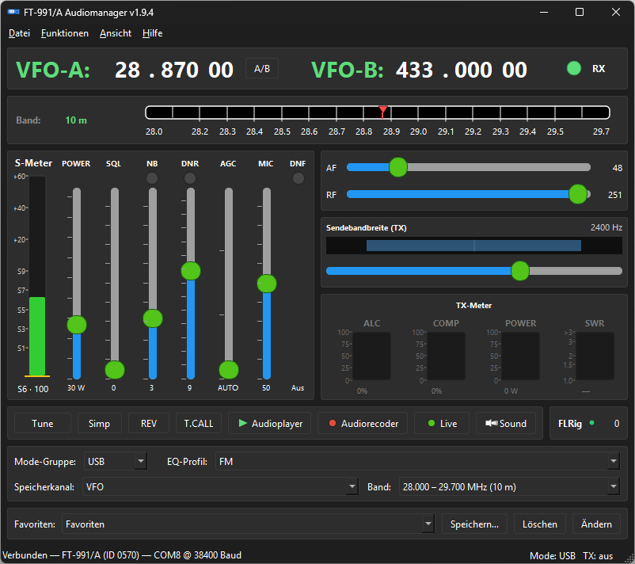

*Abb. 7: Hauptfenster — Gesamtansicht mit VFO, Band-Streifen, Meter, Funkleiste, Favoriten. (Screenshot-Platzhalter)*

### 5.1 VFO-Anzeige (oben)

- **VFO-A** und **VFO-B**: große Frequenzanzeige (MHz · kHz · Hz)
- Per **Mausrad** oder **Tastatureingabe** einstellbar (10-Hz-Raster)
- **A/B-Taste**: VFO-A und VFO-B am Funkgerät tauschen
- **Farbige Beschriftung:**
  - **Grün** — Frequenz in einem Amateurband
  - **Gelb** — CB oder Freenet
  - **Rot** — außerhalb bekannter Bänder
  - **Grau** — nicht verbunden

### 5.2 Band-Streifen

Unter der VFO-Anzeige:

- **Band:** zeigt aktuelles Band bzw. bei CB/Freenet die **Kanalnummer** (z. B. „CB 19“, „Freenet 3“)
- **Horizontaler Streifen:** Position der Frequenz im Band; per **Klicken/Ziehen** die QRG ändern
- Bei **CB** (80 Kanäle) und **Freenet** (6 Kanäle) **rastet** der Schieber auf die Kanalfrequenzen ein

### 5.3 Meter-Bereich (Mitte)

**Empfang (links):**

| Anzeige | Bedeutung |
|---------|-----------|
| **S-Meter** | Signalstärke |
| **SQL** | Squelch |
| **NB** | Noise Blanker |
| **DNR** | DSP-Rauschunterdrückung |
| **AGC** | Automatische Verstärkungsregelung (AUTO / FAST / MID / SLOW) |
| **MIC** | Mikrofonpegel (Anzeige) |
| **DNF** | DSP-Notch-Filter |
| **AF / RF** | Audio- und RF-Verstärkung (schiebbar, schreibt ans Funkgerät) |
| **Sendebandbreite TX** | SSB/CW/DATA-Bandbreite (nur in passenden Modi) |

**Sendung (rechts):**

| Anzeige | Bedeutung |
|---------|-----------|
| **POWER** | Sendeleistung (PC) — auch unter TX änderbar |
| **ALC, COMP, POWER, SWR** | TX-Meter (SWR auf 2 m/70 cm im Programm ausgeblendet — Front-Panel des Funkgeräts ist maßgeblich) |

### 5.4 Funksteuerungsleiste

| Taste | Funktion |
|-------|----------|
| **Tune** | Antennentuner starten |
| **Simp / RPT+ / RPT−** | Repeater-Shift (FM/C4FM) |
| **REV** | Relais-QRG tauschen (Eingang ↔ Ausgang) |
| **T.CALL** | 1750-Hz-Rufton — **Taste gedrückt halten** |
| **Audioplayer** | Audio-Player-Fenster öffnen |
| **Audiorecorder** | Audio-Recorder-Fenster öffnen |
| **Live** | Live‑PC Funk-Fenster öffnen |
| **Sound** | Soundeinstellungen öffnen |
| **FLRig** (LED) | Status der Rig-Bridge (grün = Server aktiv) |

### 5.5 Untere Steuerzeile

- **Betriebsart (Mode):** LSB, USB, FM, DATA-USB, CW, … — steuert auch die EQ-Anzeige
- **EQ-Profil:** Auswahl des Audioprofils; wird beim Verbinden ins Gerät geschrieben
- **Speicherkanal:** VFO oder Kanal 001–100
- **Band:** VFO oder Amateurband (setzt Mittenfrequenz auf VFO-A)

### 5.6 Favoriten

- **Favoriten-Combo** mit **Speichern…**, **Löschen**, **Ändern**
- Speichert: Frequenz, Mode, EQ-Profil, SQL, AF, RF, Sendeleistung
- Schneller Wechsel zwischen häufig genutzten Funk- und Audio-Konfigurationen

### 5.7 Statusleiste

- **Links:** Verbindungsstatus, COM-Port, Baudrate, ggf. Reconnect-Hinweis
- **Rechts:** aktuelle Betriebsart, TX-Status

---

## 6. Menü *Datei*

| Eintrag | Funktion |
|---------|----------|
| **Einstellungen…** | CAT, Rig-Bridge, Kalibrierung (siehe Kapitel 10) |
| **Verbinden** | CAT-Verbindung öffnen |
| **Trennen** | CAT trennen, UI zurücksetzen |
| **Beenden** | Programm beenden |

---

## 7. Menü *Funktionen*

### 7.1 Equalizer… (`Strg+Shift+E`)

Zentrale **TX-Audio-Konfiguration** für das Funkgerät.

**Kopfzeile:** EQ-Profil wählen, Betriebsart, Live-Sync-Status

**Profil-Verwaltung:** Speichern, Speichern unter…, Umbenennen, Löschen, Export/Import (JSON)

**Bereiche (je nach Modus):**

1. **Grundwerte**
   - MIC Gain (0–100)
   - Normal-EQ ein/aus (Menü PR1)
   - Speech Processor + Pegel (nur SSB; schließt Normal-EQ aus)
   - SSB TX-Bandbreite

2. **Parametric MIC EQ — Normal** (EX119–127)  
   Interaktive Kurve: Punkt ziehen = Frequenz/Level, hellblauer Rand = Bandbreite, Rechtsklick = Band ein/aus

3. **Parametric MIC EQ — Processor** (EX128–136)  
   Aktiv wenn Speech Processor eingeschaltet ist

4. **Erweiterte Einstellungen**  
   SSB Low/High Cut, AM/FM Carrier-Level, Mic-Quelle (Front/Rear), DATA TX-Level

> Änderungen werden **automatisch** (debounced) ans Funkgerät geschrieben. Während **TX** pausiert der Sync.

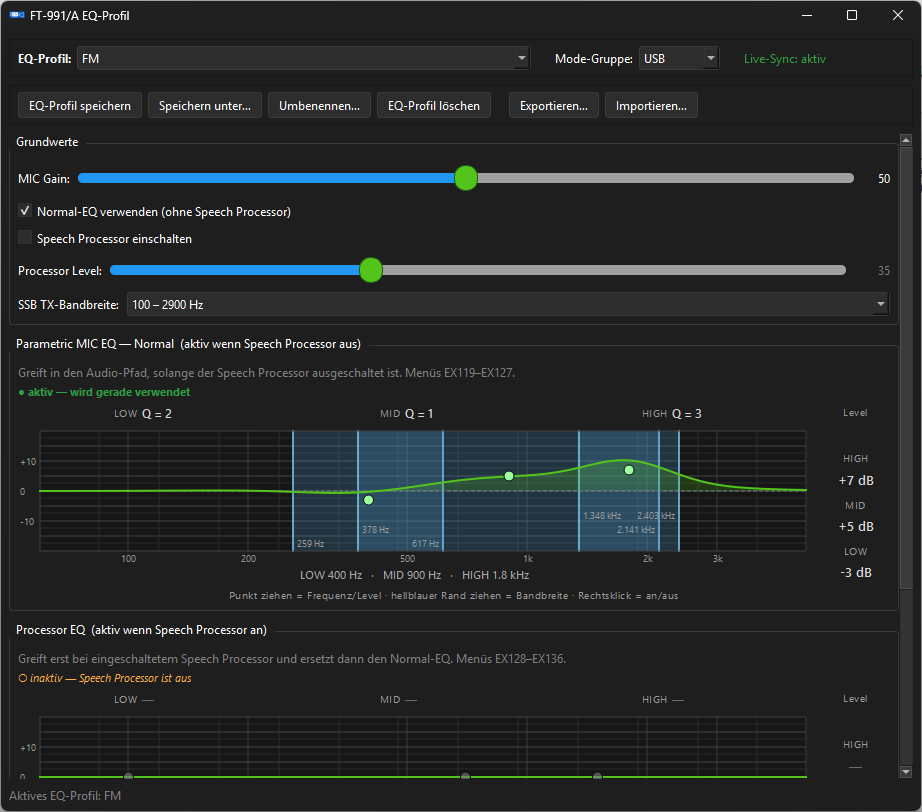

*Abb. 8: Equalizer-Fenster — Grundwerte und EQ-Kurve. (Screenshot-Platzhalter)*

---

### 7.2 Soundeinstellung… (`Strg+Shift+S`)

Siehe [Kapitel 3](#3-soundeinstellungen--grundeinrichtung).  
Zusätzlich: Lautstärkeregler pro Gerät und **Ausgabe Mithören**.

---

### 7.3 Audio-Player… (`Strg+Shift+A`)

Wiedergabe von **MP3** und **WAV** über die CAT-Schnittstelle mit automatischem **PTT**.

| Bereich | Funktion |
|---------|----------|
| **Ordner** | Verzeichnis mit Audiodateien wählen |
| **Dateiliste** | Reihenfolge per Drag & Drop ändern |
| **Play PC** | Lokales Vorhören am PC **ohne** Sendung |
| **Wiedergabe** | Start / Pause / Stopp — sendet über Funk (DATA-FM + passende Menüs) |
| **Pausen** | Wartezeit zwischen Dateien (1–600 s) |
| **Modus** | Nach jeder Datei stoppen / alle nacheinander |
| **Kontest-Loop** | Wiederholung der Playlist |
| **Lautstärke** | Sende- und PC-Lautstärke |

Beim Start mit CAT-Verbindung stellt die App automatisch **DATA-FM** und die Menüs **048 / 070 / 072 / 077 / 109** für PC-Audio ein.

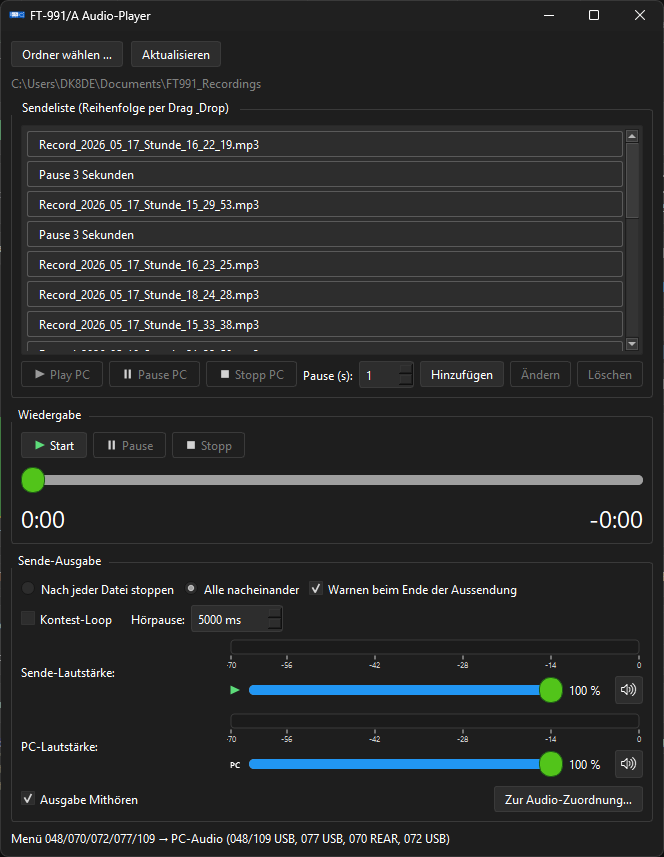

*Abb. 9: Audio-Player-Fenster. (Screenshot-Platzhalter)*

---

### 7.4 Audio-Recorder… (`Strg+Shift+R`)

| Bereich | Funktion |
|---------|----------|
| **Aufnahme** | Empfang vom Funk-USB-CODEC als **MP3** aufzeichnen |
| **Replay** | Aufnahme einmalig per CAT-TX wieder abspielen |
| **Play PC** | Datei lokal am PC anhören |
| **Format** | MP3-Bitrate wählbar |
| **Ordner** | Aufnahme-Verzeichnis, Explorer öffnen |

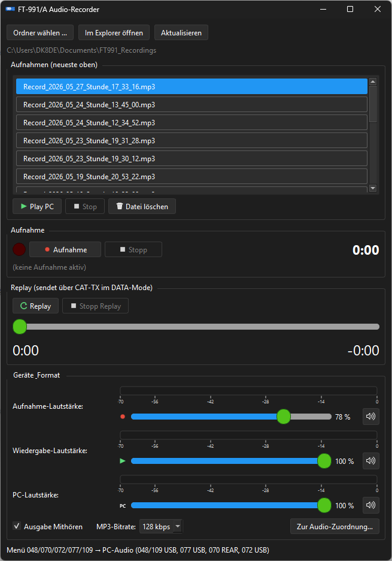

*Abb. 10: Audio-Recorder-Fenster. (Screenshot-Platzhalter)*

---

### 7.5 Live‑PC Funk… (`Strg+Shift+L`)

Sprache vom **PC-Mikrofon** über DSP ins Funkgerät — ideal für Headset-Betrieb.

| Bereich | Funktion |
|---------|----------|
| **Siebenband-EQ** | Kurven-Editor, EQ gesamt ein/aus |
| **Lautstärke-Streifen** | Mic·Send, Monitor, Funk-Eingabe, Funk-Ausgabe mit Pegelanzeige |
| **TX Noise Gate** | Rauschunterdrückung vor dem Senden (Schwellwert, Attack, Hold, Release) |
| **Kompressor** | Threshold, Ratio, Attack, Release, Make-up |
| **RX Noise Gate** | Rauschgate für den Funk-Mithör-Eingang |
| **PTT** | Taste gedrückt halten — `Strg+Y` |
| **PTT halten** | Einrasten — `Strg+X` |
| **Live-Profil** | Konfiguration speichern, laden, löschen |
| **AFL** | Eigene NF abhören — bearbeitetes Mikro auf Monitor |
| **Audio Zuordnung** | Öffnet die Soundeinstellungen |

> Live startet nicht, wenn gleichzeitig Player oder Recorder senden/aufnehmen.

**Sicherheitshinweis:** Bei geschlossenen Audio-Leitungen zwischen PC und Funk wird eine **galvanische Trennung** im Audio-Pfad empfohlen (siehe README).

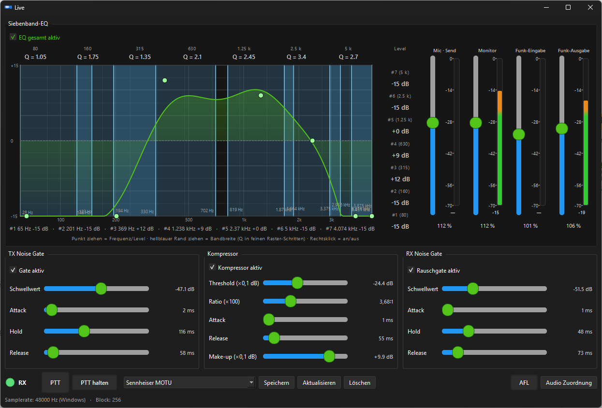

*Abb. 11: Live‑PC Funk — EQ, Gates, Kompressor, PTT. (Screenshot-Platzhalter)*

---

### 7.6 Speicherkanäle… (`Strg+Shift+K`)

Editor für alle **100 Speicherkanäle** des FT-991.

| Funktion | Beschreibung |
|----------|--------------|
| **Tabelle** | Nr., Name, RX MHz, Mode, Offset, Ton, CTCSS/DCS, Power/SQL (lokal), Notiz |
| **Filter** | Suche, Band (2 m, 70 cm, HF, leer, belegt) |
| **Neu laden / Speichern** | Kanäle vom Funkgerät lesen bzw. schreiben |
| **Export / Import** | JSON oder CSV |
| **Kanal → VFO / VFO → Kanal** | Inhalt zwischen VFO und Speicherplatz tauschen |
| **Reihenfolge** | Kanäle verschieben, duplizieren, Lücken schließen |

CAT-Verbindung erforderlich. Vor Schreibvorgängen wird automatisch eine Sicherung erstellt.

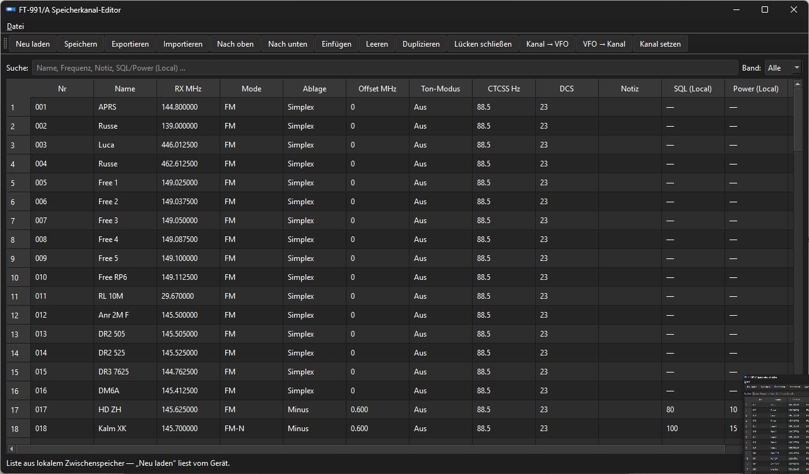

*Abb. 12: Speicherkanal-Editor. (Screenshot-Platzhalter)*

---

## 8. Menü *Ansicht*

| Eintrag | Funktion |
|---------|----------|
| **CAT-Log anzeigen** | CAT-Protokoll-Fenster ein-/ausblenden (`Strg+L`) |
| **Sprache → Deutsch / English** | Oberflächensprache umschalten |

Die Anwendung verwendet dauerhaft das **Dark Theme**.

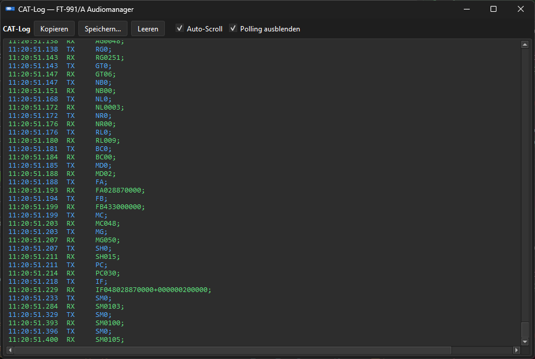

*Abb. 13: CAT-Log-Fenster mit TX/RX-Einträgen. (Screenshot-Platzhalter)*

---

## 9. Menü *Hilfe*

| Eintrag | Funktion |
|---------|----------|
| **Version** | About-Fenster: Version, Autor, Datum, Lizenz (Apache 2.0), GitHub-Link |
| **Anleitung** | Öffnet das Handbuch-PDF des aktuellen Releases auf GitHub im Browser (Deutsch oder Englisch je nach *Ansicht → Sprache*) |
| **Update prüfen…** | Vergleich mit dem neuesten GitHub-Release; Link zum Download bei neuer Version |

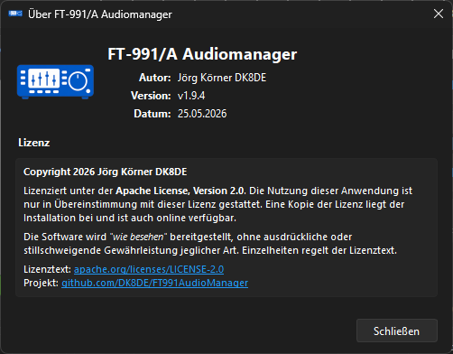

*Abb. 16: Hilfe → Version (About-Fenster). (Screenshot-Platzhalter)*

---

## 10. Einstellungsdialog im Detail

**Datei → Einstellungen…** — drei Bereiche in der linken Navigation:

### 10.1 CAT-Verbindung

- COM-Port, Baudrate (38400 Standard), Timeout
- **Verbindung testen**
- **Auto-Connect** beim Start + automatischer Reconnect
- **Live-Meter Polling:** Intervalle für TX und RX
- **TX-Polling:** welche Werte auch während Sendung gelesen werden
- **EQ:** Erweiterte SSB-Einstellungen im Equalizer ausblenden

*(Siehe Abb. 3 für den CAT-Bereich.)*

### 10.2 Rig-Bridge

Ermöglicht die Nutzung von **WSJT-X**, **FLRig** und anderen CAT-Clients parallel zur App.

- Rig-Bridge aktivieren
- FLRig-Server: Host (Standard `127.0.0.1`), Port (Standard `12345`)
- Auto-Start bei CAT-Verbindung
- Status-LED in der Funksteuerungsleiste zeigt Server-Aktivität

**Empfohlene Reihenfolge:** Zuerst in der App verbinden → dann Rig-Bridge starten → in WSJT-X *Radio → FLRig* mit gleichem Host/Port.

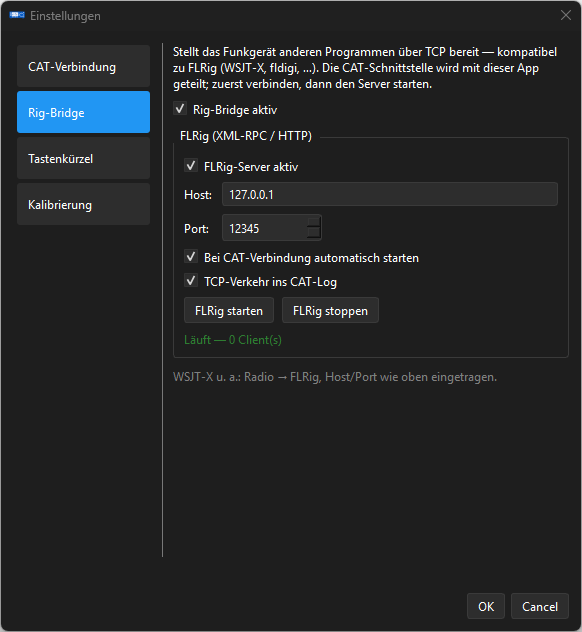

*Abb. 14: Einstellungen → Rig-Bridge. (Screenshot-Platzhalter)*

### 10.3 Kalibrierung

**S-Meter:** Eigene Kurven für Kurzwelle und 2 m/70 cm

**PO-Meter (10 m KW):** Automatische Kalibrieration der Sendeleistungsanzeige — nur mit geeigneter KW-Antenne am KW-Anschluss und nach Bestätigung des Sicherheitshinweises.

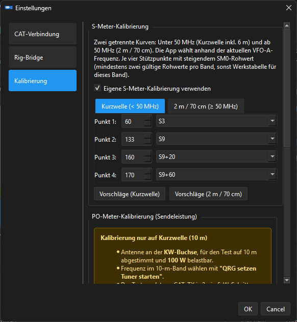

*Abb. 15: Einstellungen → Kalibrierung (S-Meter / PO). (Screenshot-Platzhalter)*

---

## 11. Tastenkürzel

| Kürzel | Aktion |
|--------|--------|
| `Strg+E` | Einstellungen |
| `Strg+V` | Verbinden |
| `Strg+T` | Trennen |
| `Strg+Q` | Beenden |
| `Strg+L` | CAT-Log |
| `Strg+Shift+E` | Equalizer |
| `Strg+Shift+S` | Soundeinstellung |
| `Strg+Shift+A` | Audio-Player |
| `Strg+Shift+R` | Audio-Recorder |
| `Strg+Shift+L` | Live‑PC Funk |
| `Strg+Shift+K` | Speicherkanäle |
| `Strg+Y` | Live: PTT halten |
| `Strg+X` | Live: PTT einrasten |

---

## 12. Fehlerbehebung

| Problem | Lösung |
|---------|--------|
| Keine CAT-Antwort | Richtigen **Enhanced COM Port** wählen; **Menü 031** = 38400; USB-Kabel; Funkgerät eingeschaltet |
| Zwei COM-Ports — welcher? | **Verbindung testen** in den Einstellungen; bei Fehlschlag anderen Port probieren |
| Frequenz/Mode werden nicht angezeigt | **Verbinden** (`Strg+V`); Statusleiste prüfen |
| Kein Ton beim Player/Recorder | Soundeinstellungen prüfen (Kapitel 3); Menüs 048/070/072/077/109; DATA-FM |
| Live ohne Audio | Live-Gerätezuordnung prüfen; PTT gedrückt halten; Blockierung durch Player/Recorder beenden |
| SmartScreen blockiert | Siehe [Kapitel 1.2](#12-hinweis-zu-windows-sicherheit-smartscreen--antivirus) |

---

## 13. Anhang: Wichtige FT-991-Menüs

| Menü | Bezeichnung | Bedeutung für die App |
|------|-------------|----------------------|
| **031** | CAT RATE | Baudrate CAT (38400 Werkstandard) |
| **048** | USB Audio Routing | PC-Audio-Pfad |
| **070** | Mic Input | Mikrofonquelle (REAR/USB) |
| **072** | USB Audio Codec | USB-Codec-Auswahl |
| **077** | USB Audio Destination | Ziel der USB-Audio-Ausgabe |
| **109** | USB Audio Source | Quelle der USB-Audio-Eingabe |
| **PR1** | Parametric MIC EQ | Normal-EQ ein/aus |
| **EX119–127** | Normal-EQ Bänder | Parametric EQ (Speech Processor aus) |
| **EX128–136** | Processor-EQ Bänder | Parametric EQ (Speech Processor an) |

---

*Ende der Bedienungsanleitung — FT-991/A Audiomanager*