# FT-991/A Audio Manager — User Manual

**Version:** see *Help → Version* in the application  
**Author:** Jörg Körner, DK8DE  
**Download & updates:** [GitHub Releases](https://github.com/DK8DE/FT991AudioManager/releases)  
**German version:** [Bedienungsanleitung.md](Bedienungsanleitung.md)  
**Screenshots:** folder [`docs/screenshots/en/`](docs/screenshots/en/) — see [README there](docs/screenshots/README.md)

---

## Table of contents

1. [Installation](#1-installation)
2. [Radio setup (CAT)](#2-radio-setup-cat)
3. [Sound settings — basic setup](#3-sound-settings--basic-setup)
4. [Connecting and disconnecting](#4-connecting-and-disconnecting)
5. [Main window](#5-main-window)
6. [File menu](#6-file-menu)
7. [Functions menu](#7-functions-menu)
8. [View menu](#8-view-menu)
9. [Help menu](#9-help-menu)
10. [Settings dialog in detail](#10-settings-dialog-in-detail)
11. [Keyboard shortcuts](#11-keyboard-shortcuts)
12. [Troubleshooting](#12-troubleshooting)
13. [Appendix: Important FT-991 menus](#13-appendix-important-ft-991-menus)

---

## 1. Installation

### 1.1 Download from GitHub

1. Open the releases page:  
   **https://github.com/DK8DE/FT991AudioManager/releases**
2. Download the current version:
   - **Windows installer** (recommended), or
   - **ZIP / portable** package from the release assets
3. Run the installer or extract the archive to a folder of your choice.

*Fig. 1: GitHub Releases page — select the current release and download asset. (Screenshot placeholder)*

### 1.2 Windows security (SmartScreen & antivirus)

Because this program is from an independent developer and not distributed via the Microsoft Store, Windows may classify it as **unknown**:

| Message | What to do |
|---------|------------|
| **Windows SmartScreen** (“Windows protected your PC … Unknown publisher”) | Click **More info** → **Run anyway** |
| **Antivirus / Defender** on download | Mark the file as **trusted** or add an exception |
| **Blocked during installation** | Right-click installer → **Run as administrator** (if needed) and confirm again |

This is normal for amateur-radio software built outside the Store. It does not automatically mean the software is harmful. Download **only** from the official GitHub page above.

### 1.3 First start

After installation, launch **FT-991/A Audio Manager** from the Start menu or desktop shortcut. On first start, no CAT settings are saved yet — that is expected.

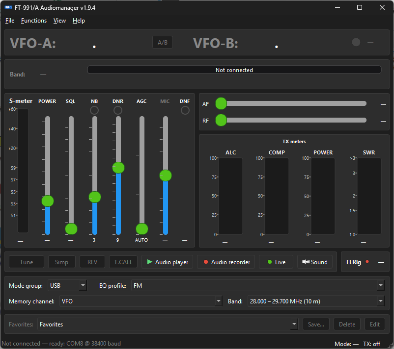

*Fig. 2: Main window without CAT connection. (Screenshot placeholder)*

---

## 2. Radio setup (CAT)

### 2.1 USB connection

1. Connect the **FT-991** or **FT-991A** to the PC via **USB** (built-in USB port or **SCU-17**).
2. Turn the radio **on**.
3. Windows may install the USB driver automatically; wait until the COM port appears in Device Manager.

### 2.2 Select COM port in the software

1. In the app: **File → Settings…** (`Ctrl+E`)
2. Under **CAT connection**, select the correct **COM port**.
3. Click **Refresh** if needed to update the port list.

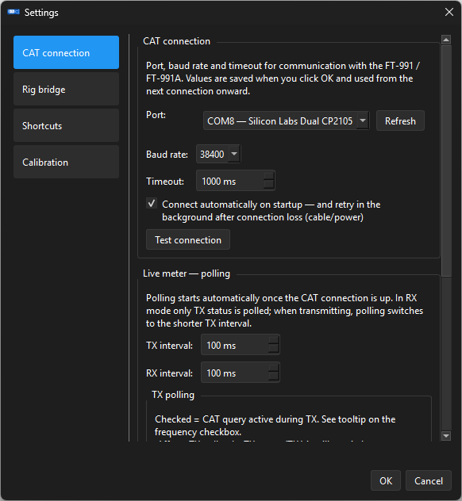

*Fig. 3: Settings → CAT connection — port, baud rate, test connection. (Screenshot placeholder)*

> **Important — two identical-looking COM ports**  
> On the FT-991(A), Windows typically shows **two** COM ports:
>
> | Port | Meaning |
> |------|---------|
> | **Enhanced COM Port** | ✅ **CAT interface** — use this one! |
> | **Standard COM Port** | ❌ CAT TIMING / TX trigger — **not** for this software |
>
> If unsure: pick a port → **Test connection** (below). If the radio does not respond, try the **other** port.

### 2.3 Baud rate on the radio

The factory **CAT baud rate** is **38400**.

**On the FT-991 / FT-991A:**

1. Press **[MENU]**
2. Open menu item **031** — label: **`CAT RATE`**
3. Set the value to **38400** (or 4800 / 9600 / 19200 — then use the **same** rate in the app)
4. Confirm and leave the menu

In the app (**File → Settings… → CAT connection**), the **baud rate must match** (default: **38400**).

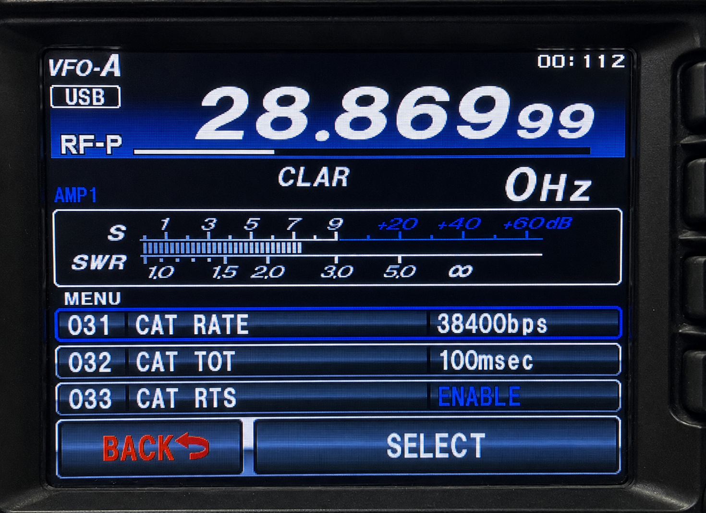

*Fig. 4: Radio — menu 031 “CAT RATE” set to 38400. (Screenshot placeholder)*

### 2.4 Test connection

In settings under **CAT connection**:

1. Set port and baud rate
2. Click **Test connection**
3. On success, a confirmation with the device ID (FT-991 / FT-991A) appears

### 2.5 Success check

When everything is configured correctly, after **File → Connect** (`Ctrl+V`):

- **Frequency** (VFO-A and optionally VFO-B) should appear in the software,
- **Operating mode** (LSB, USB, FM, …) should match the radio,
- **S-meter**, SQL, AGC and other values should update live,
- The **status bar** at the bottom should show “Connected” with port and baud rate.

*Fig. 5: Main window with active CAT connection — frequency, mode, meters, status bar. (Screenshot placeholder)*

---

## 3. Sound settings — basic setup

Audio routing is essential for **Audio Player**, **Audio Recorder**, and **Live PC Radio**.

Open: **Functions → Sound settings…** (`Ctrl+Shift+S`)  
or click **Sound** in the radio control bar on the main window.

### 3.1 Devices & volume (Player / Recorder)

Typical mapping when using the radio’s **USB Audio CODEC**:

| # | Setting | Device (example) |
|---|---------|------------------|
| 1 | **Recording device** | `Microphone (USB Audio CODEC)` |
| 2 | **TX output** | `Speakers (USB Audio CODEC)` |
| 3 | **PC output** | Your **PC sound card / speakers** (local monitoring) |

Set the desired **volume** for each device.

Optional: **TX monitor** — during CAT transmission (Player/Recorder), audio is also routed to the PC output.

### 3.2 Live PC Radio mapping

| # | Setting | Device (example) |
|---|---------|------------------|
| 1 | **PC microphone for Live** | Your **PC microphone** for operating |
| 2 | **Monitor** | Your **PC speakers or headphones** (monitoring) |
| 3 | **Radio input** | `Speakers (USB Audio CODEC)` (RX from radio → PC) |
| 4 | **Radio output / Live TX output** | `Microphone (USB Audio CODEC)` (your voice → radio) |

> **Note:** Exact device names may vary slightly depending on the Windows driver (e.g. “Yaesu USB Audio”). Always pick the device that belongs to the radio’s **USB Audio CODEC**.

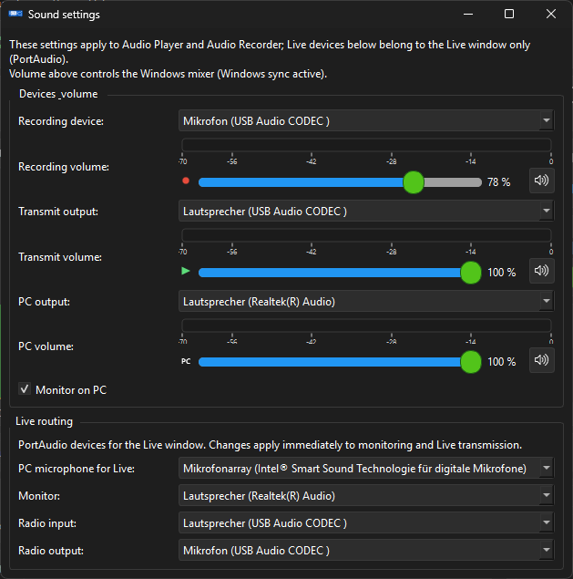

*Fig. 6: Sound settings — devices & volume and Live PC Radio mapping (single window). (Screenshot placeholder)*

### 3.3 Basic setup complete

With correct CAT connection and sound mapping, **basic configuration** is done. The following chapters describe all windows and features in detail.

---

## 4. Connecting and disconnecting

| Action | Menu / shortcut |
|--------|-----------------|
| Connect | **File → Connect** — `Ctrl+V` |
| Disconnect | **File → Disconnect** — `Ctrl+T` |
| Settings | **File → Settings…** — `Ctrl+E` |

**Auto-connect:** In settings, you can enable *Connect automatically on startup*. On connection loss, the app silently retries every 2 seconds in the background — until you choose **Disconnect** manually.

**After connecting**, the app writes the selected **EQ profile** to the radio, loads memory channels (or uses a cache), and starts **meter polling**.

---

## 5. Main window

The main window is the central control panel — VFO, meters, profiles, and quick access.

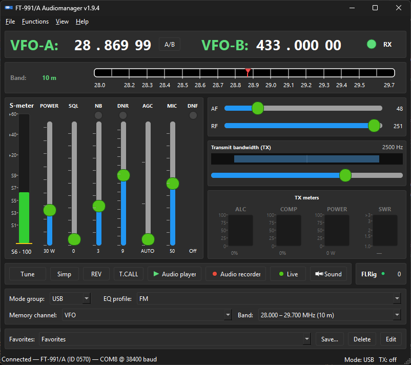

*Fig. 7: Main window — full view with VFO, band strip, meters, control bar, favorites. (Screenshot placeholder)*

### 5.1 VFO display (top)

- **VFO-A** and **VFO-B**: large frequency display (MHz · kHz · Hz)
- Adjustable via **mouse wheel** or **keyboard** (10 Hz steps)
- **A/B button**: swap VFO-A and VFO-B on the radio
- **Caption colours:**
  - **Green** — frequency in an amateur band
  - **Yellow** — CB or Freenet
  - **Red** — outside known bands
  - **Grey** — not connected

### 5.2 Band strip

Below the VFO display:

- **Band:** shows current band or **channel number** for CB/Freenet (e.g. “CB 19”, “Freenet 3”)
- **Horizontal strip:** frequency position in the band; **click/drag** to change QRG
- For **CB** (80 channels) and **Freenet** (6 channels), the slider **snaps** to channel frequencies

### 5.3 Meter area (centre)

**Receive (left):**

| Display | Meaning |
|---------|---------|
| **S-meter** | Signal strength |
| **SQL** | Squelch |
| **NB** | Noise blanker |
| **DNR** | DSP noise reduction |
| **AGC** | Automatic gain control (AUTO / FAST / MID / SLOW) |
| **MIC** | Microphone level (display) |
| **DNF** | DSP notch filter |
| **AF / RF** | Audio and RF gain (sliders, written to radio) |
| **TX bandwidth** | SSB/CW/DATA bandwidth (in applicable modes only) |

**Transmit (right):**

| Display | Meaning |
|---------|---------|
| **POWER** | TX power (PC) — adjustable even while transmitting |
| **ALC, COMP, POWER, SWR** | TX meters (SWR hidden on 2 m/70 cm in the app — radio front panel is authoritative) |

### 5.4 Radio control bar

| Button | Function |
|--------|----------|
| **Tune** | Start antenna tuner |
| **Simp / RPT+ / RPT−** | Repeater shift (FM/C4FM) |
| **REV** | Swap relay QRG (input ↔ output) |
| **T.CALL** | 1750 Hz tone — **hold button down** |
| **Audio player** | Open audio player window |
| **Audio recorder** | Open audio recorder window |
| **Live** | Open Live PC Radio window |
| **Sound** | Open sound settings |
| **FLRig** (LED) | Rig bridge status (green = server active) |

### 5.5 Bottom control row

- **Mode:** LSB, USB, FM, DATA-USB, CW, … — also controls EQ display
- **EQ profile:** audio profile selection; written to radio on connect  
  > **Note:** The parametric MIC equalizer only works in **SSB (LSB/USB)** and **AM** on the FT-991/A. In FM, FM-N, DATA-\*, C4FM, CW and RTTY modes the profile selector and EQ editor are locked (greyed out). Switching back to SSB or AM re-enables them immediately.
- **Memory channel:** VFO or channel 001–100
- **Band:** VFO or amateur band (sets centre frequency on VFO-A)

### 5.6 Favorites

- **Favorites** combo with **Save…**, **Delete**, **Edit**
- Stores: frequency, mode, EQ profile, SQL, AF, RF, TX power
- Quick switching between frequently used radio and audio setups

### 5.7 Status bar

- **Left:** connection status, COM port, baud rate, reconnect hint if applicable
- **Right:** current mode, TX status

---

## 6. File menu

| Item | Function |
|------|----------|
| **Settings…** | CAT, rig bridge, calibration (see chapter 10) |
| **Connect** | Open CAT connection |
| **Disconnect** | Close CAT, reset UI |
| **Quit** | Exit application |

---

## 7. Functions menu

### 7.1 Equalizer… (`Ctrl+Shift+E`)

Central **TX audio configuration** for the radio.

> **Important — mode restriction:** According to the Yaesu manual, the parametric MIC equalizer on the FT-991/A only works in **SSB (LSB/USB) and AM**. In FM, FM-N, DATA-\*, C4FM, CW and RTTY modes the EQ has no effect. When you switch to one of these modes, the profile selector and Normal EQ editor are automatically locked (greyed out); the sync status shows "EQ not available in this mode". Switching back to SSB or AM removes the lock immediately.

**Header:** EQ profile, operating mode, live sync status

**Profile management:** Save, Save as…, Rename, Delete, Export/Import (JSON)

**Sections (mode-dependent):**

1. **Basic values** *(SSB/AM only)*
   - MIC gain (0–100)
   - Normal EQ on/off (menu PR1)
   - Speech processor + level (SSB only; disables Normal EQ)
   - SSB TX bandwidth

2. **Parametric MIC EQ — Normal** (EX119–127) *(SSB/AM only)*  
   Interactive curve: drag point = frequency/level, light-blue edge = bandwidth, right-click = band on/off

3. **Parametric MIC EQ — Processor** (EX128–136) *(SSB only)*  
   Active when speech processor is on

4. **Advanced settings**  
   SSB low/high cut, AM/FM carrier level, mic source (Front/Rear), DATA TX level  
   *(fields shown/hidden depending on mode)*

> Changes are **automatically** (debounced) written to the radio. Sync **pauses during TX**.

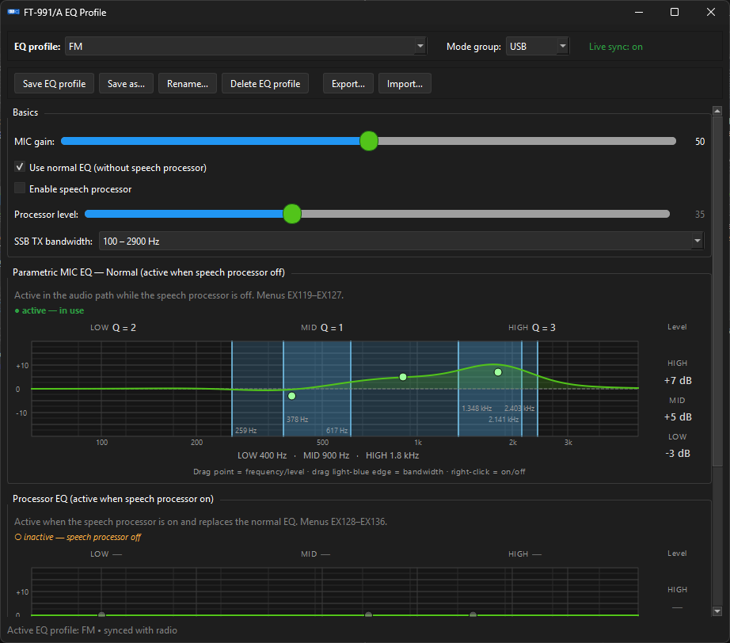

*Fig. 8: Equalizer window — basic values and EQ curve. (Screenshot placeholder)*

---

### 7.2 Sound settings… (`Ctrl+Shift+S`)

See [chapter 3](#3-sound-settings--basic-setup).  
Additionally: per-device volume sliders and **TX monitor**.

---

### 7.3 Audio player… (`Ctrl+Shift+A`)

Playback of **MP3** and **WAV** via CAT with automatic **PTT**.

| Area | Function |
|------|----------|
| **Folder** | Select directory with audio files |
| **File list** | Reorder via drag & drop |
| **Play PC** | Local monitoring on PC **without** transmitting |
| **Playback** | Start / Pause / Stop — transmits via radio (DATA-FM + appropriate menus) |
| **Pauses** | Wait time between files (1–600 s) |
| **Mode** | Stop after each file / play all in sequence |
| **Contest loop** | Repeat playlist |
| **Volume** | TX and PC volume |

With CAT connected, the app automatically sets **DATA-FM** and menus **048 / 070 / 072 / 077 / 109** for PC audio.

> **With Live window open:** The player can run in parallel with Live PC Radio. Live PTT **stops playback** (like the hand microphone on the radio).

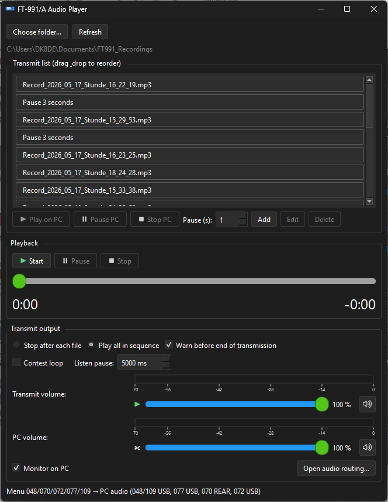

*Fig. 9: Audio player window. (Screenshot placeholder)*

---

### 7.4 Audio recorder… (`Ctrl+Shift+R`)

| Area | Function |
|------|----------|
| **Recording** | **Without** Live window: **RX only** from the radio USB CODEC as **MP3**. **With** Live window open: **stereo** (L = **TX** via Live PC mic, R = **RX** from the radio) |
| **Replay** | Play the recording once via CAT TX — also when the Live window is open |
| **Play PC** | Listen locally on PC |
| **Format** | Selectable MP3 bitrate |
| **Folder** | Recording directory, open in Explorer |

> **Recording modes:** If the Live window is **not** open, the recorder captures only the audio **coming into** the radio (USB receive path). If the Live window **is** open, **both directions** are recorded in parallel: **left** = your Live transmission from the PC microphone (after DSP), **right** = radio receive. An ongoing recording is **not** interrupted by Live PTT.

> **Live + Player/Recorder:** With the Live window open, **audio player** and **audio recorder** can run in parallel — **replay** and **player playback** work as well. Live PTT interrupts **playback and replay** (like the hand microphone), **not** an ongoing recording. Without the Live window, the previous rule applies: Live will not start while the player or recorder is active.

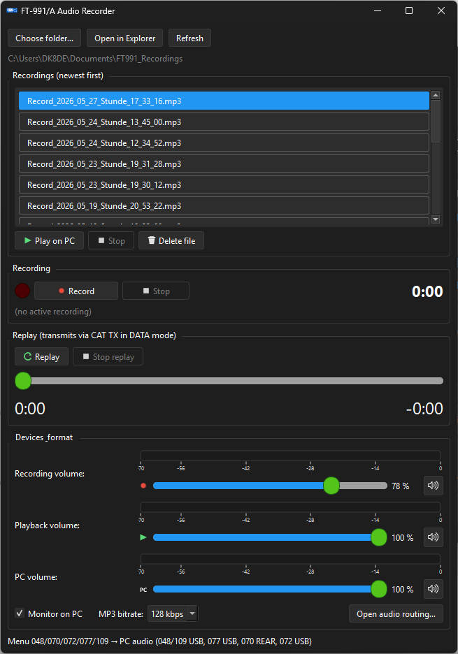

*Fig. 10: Audio recorder window. (Screenshot placeholder)*

---

### 7.5 Live PC Radio… (`Ctrl+Shift+L`)

Voice from **PC microphone** through DSP to the radio — ideal for headset operation.

| Area | Function |
|------|----------|
| **Seven-band EQ** | Curve editor, master EQ on/off |
| **Volume strips** | Mic·TX, monitor, radio in, radio out with level meters |
| **TX noise gate** | Noise suppression before TX (threshold, attack, hold, release) |
| **Compressor** | Threshold, ratio, attack, release, make-up |
| **RX noise gate** | Noise gate for radio monitor input |
| **PTT** | Hold button — `Ctrl+Y` |
| **PTT latch** | Toggle latch — `Ctrl+X` |
| **Live profile** | Save, load, delete configuration |
| **AFL** | Monitor processed mic on monitor output |
| **Audio routing** | Opens sound settings |

> **Parallel with player/recorder:** For **recording** (RX only vs. stereo TX+RX) and **replay** with the Live window open, see section **7.4 Audio recorder**. Live PTT interrupts **playback and replay**, not an ongoing recording.

**Safety note:** When audio lines are closed between PC and radio, **galvanic isolation** on the audio path is recommended (see README).

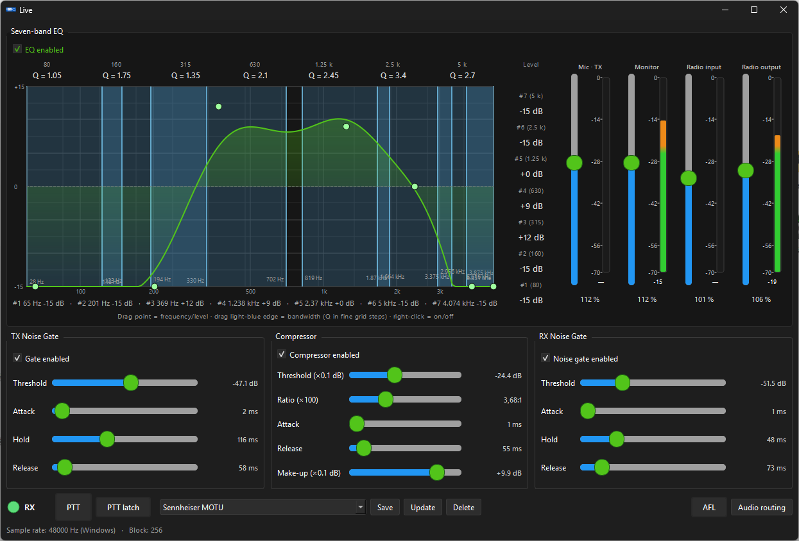

*Fig. 11: Live PC Radio — EQ, gates, compressor, PTT. (Screenshot placeholder)*

---

### 7.6 Memory channels… (`Ctrl+Shift+K`)

Editor for all **100 memory channels** of the FT-991.

| Function | Description |
|----------|-------------|
| **Table** | No., name, RX MHz, mode, offset, tone, CTCSS/DCS, power/SQL (local), note |
| **Filter** | Search, band (2 m, 70 cm, HF, empty, used) |
| **Reload / Save** | Read from or write to radio |
| **Export / Import** | JSON or CSV |
| **Channel → VFO / VFO → Channel** | Swap between VFO and memory slot |
| **Order** | Move, duplicate, close gaps |

CAT connection required. A backup is created automatically before write operations.

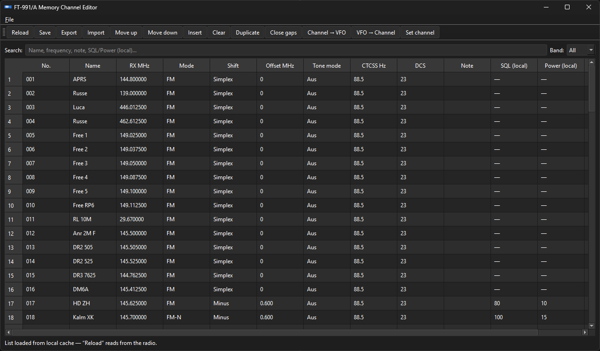

*Fig. 12: Memory channel editor. (Screenshot placeholder)*

---

## 8. View menu

| Item | Function |
|------|----------|
| **Show CAT log** | Toggle CAT log window (`Ctrl+L`) |
| **Language → Deutsch / English** | Switch UI language |

The application always uses the **dark theme**.

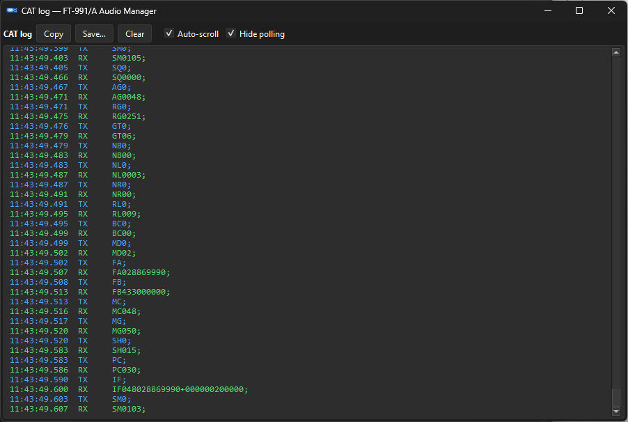

*Fig. 13: CAT log window with TX/RX entries. (Screenshot placeholder)*

---

## 9. Help menu

| Item | Function |
|------|----------|
| **Version** | About window: version, author, date, license (Apache 2.0), GitHub link |
| **Manual** | Opens the user-manual PDF for the installed release on GitHub in your browser (German or English per *View → Language*) |
| **Check for updates…** | Compare with latest GitHub release; download link if newer version exists |

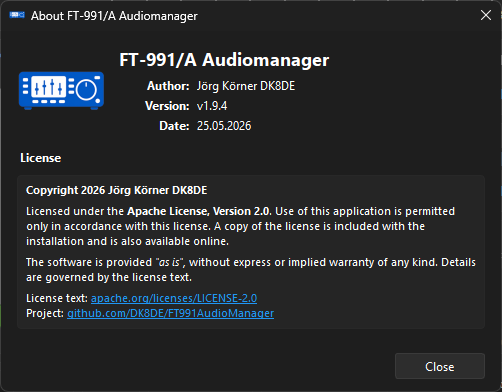

*Fig. 16: Help → Version (About window). (Screenshot placeholder)*

---

## 10. Settings dialog in detail

**File → Settings…** — three sections in the left navigation:

### 10.1 CAT connection

- COM port, baud rate (38400 default), timeout
- **Test connection**
- **Auto-connect** on startup + automatic reconnect
- **Live meter polling:** TX and RX intervals
- **TX polling:** which values are read during transmission
- **EQ:** hide advanced SSB settings in equalizer

*(See Fig. 3 for the CAT section.)*

### 10.2 Rig bridge

Enables **WSJT-X**, **FLRig**, and other CAT clients alongside the app.

- Enable rig bridge
- FLRig server: host (default `127.0.0.1`), port (default `12345`)
- Auto-start on CAT connection
- Status LED in control bar shows server activity

**Recommended order:** Connect in the app first → start rig bridge → in WSJT-X *Radio → FLRig* with same host/port.

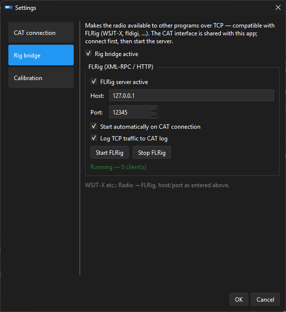

*Fig. 14: Settings → Rig bridge. (Screenshot placeholder)*

### 10.3 Calibration

**S-meter:** Custom curves for HF and 2 m/70 cm

**PO meter (10 m HF):** Automatic TX power display calibration — only with suitable HF antenna on the HF connector and after confirming the safety warning.

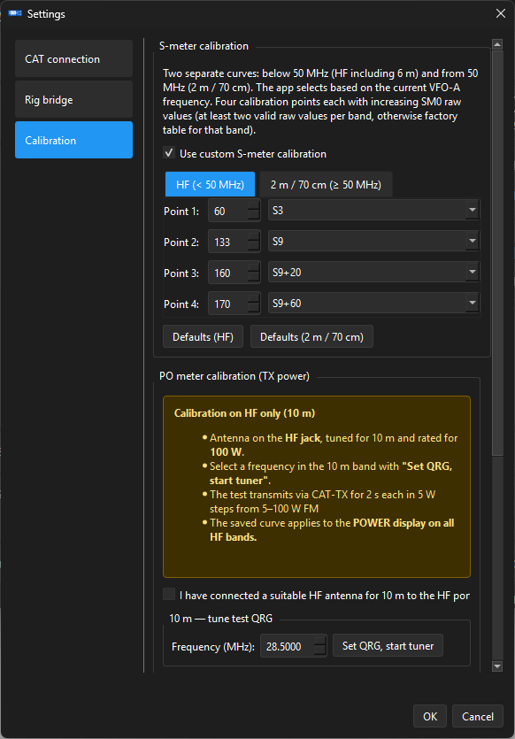

*Fig. 15: Settings → Calibration (S-meter / PO). (Screenshot placeholder)*

---

## 11. Keyboard shortcuts

| Shortcut | Action |
|----------|--------|
| `Ctrl+E` | Settings |
| `Ctrl+V` | Connect |
| `Ctrl+T` | Disconnect |
| `Ctrl+Q` | Quit |
| `Ctrl+L` | CAT log |
| `Ctrl+Shift+E` | Equalizer |
| `Ctrl+Shift+S` | Sound settings |
| `Ctrl+Shift+A` | Audio player |
| `Ctrl+Shift+R` | Audio recorder |
| `Ctrl+Shift+L` | Live PC Radio |
| `Ctrl+Shift+K` | Memory channels |
| `Ctrl+Y` | Live: PTT hold |
| `Ctrl+X` | Live: PTT latch |

---

## 12. Troubleshooting

| Problem | Solution |
|---------|----------|
| No CAT response | Correct **Enhanced COM port**; **menu 031** = 38400; USB cable; radio powered on |
| Two COM ports — which one? | **Test connection** in settings; try the other port on failure |
| Frequency/mode not shown | **Connect** (`Ctrl+V`); check status bar |
| No audio in Player/Recorder | Check sound settings (chapter 3); menus 048/070/072/077/109; DATA-FM |
| Live has no audio | Check Live device mapping; hold PTT; without Live window: stop player/recorder if Live is blocked |
| SmartScreen blocks install | See [chapter 1.2](#12-windows-security-smartscreen--antivirus) |

---

## 13. Appendix: Important FT-991 menus

| Menu | Label | Relevance for the app |
|------|-------|----------------------|
| **031** | CAT RATE | CAT baud rate (38400 factory default) |
| **048** | USB Audio Routing | PC audio path |
| **070** | Mic Input | Microphone source (REAR/USB) |
| **072** | USB Audio Codec | USB codec selection |
| **077** | USB Audio Destination | USB audio output destination |
| **109** | USB Audio Source | USB audio input source |
| **PR1** | Parametric MIC EQ | Normal EQ on/off |
| **EX119–127** | Normal EQ bands | Parametric EQ (speech processor off) |
| **EX128–136** | Processor EQ bands | Parametric EQ (speech processor on) |

---

*End of user manual — FT-991/A Audio Manager*